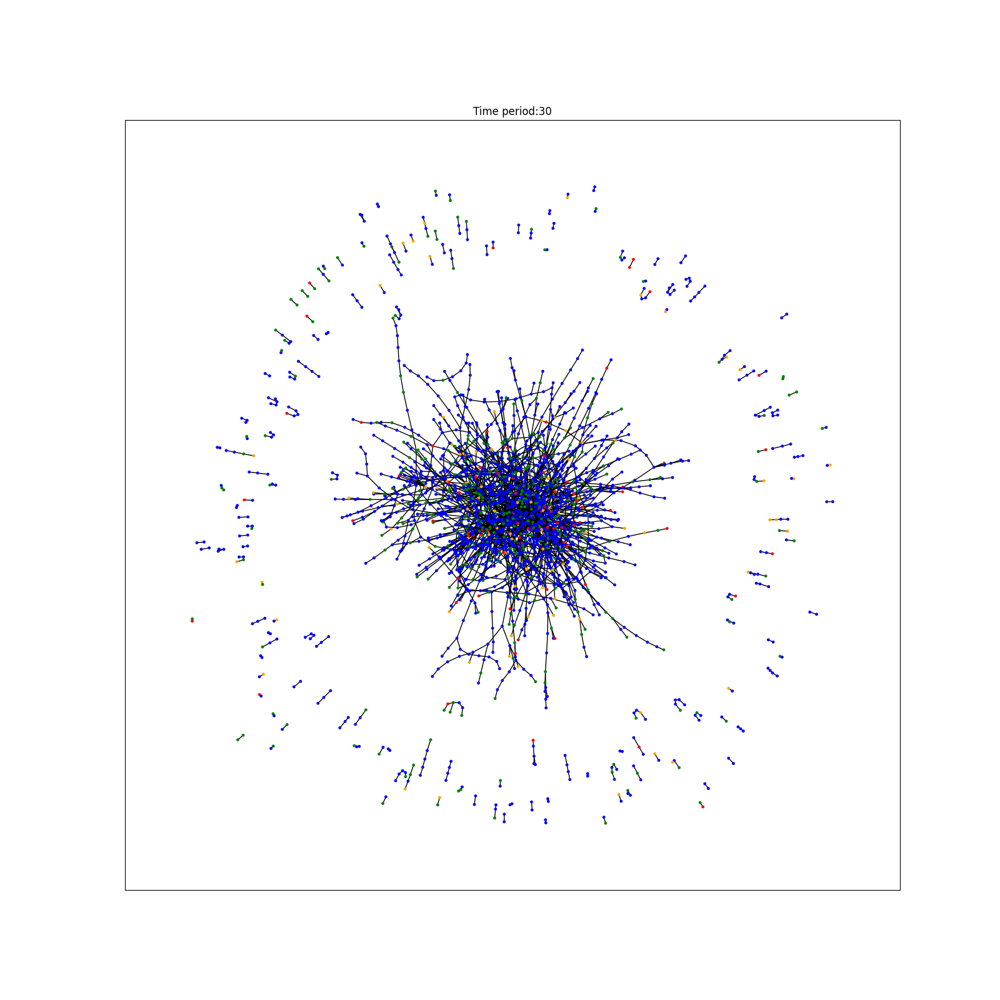

# Fraud Detection with Graph Neural Networks
Detect fraud in transactions graphs using various ready-to-use models and datasets.

Models:
- [x] GAT
- [x] GCN
- [x] GIN
- [ ] GraphSAGE
- [ ] MPNN
- [ ] GTN

Datasets:
- [x] [Elliptic](https://www.kaggle.com/datasets/ellipticco/elliptic-data-set)
- [ ] [YelpFraud](https://paperswithcode.com/dataset/yelpchi)
- [ ] [AmazonFraud](https://paperswithcode.com/dataset/amazon-fraud)

## Installation
First install the requirements.
```bash
pip install -r requirements.txt
```

## Download Dataset
Download and extract the required datasets. This project currently only supports Elliptic. A dataset must have 3 files:
- Edge list
- Classes
- Features

Then provide the required `torch.utils.data.Dataset` class for your own dataset like [here](fraud_detection/datasets.py)


## Training
To train a model you need a config file. By default, these files are located at `configs/`. For example to train a GAT model
on Elliptic run:
```bash
python train --config configs/elliptic_gat.yaml
```
The models are trained for 100 epochs and results are verbosed every 10 epochs and logged to Tensorboard.

## Visualization
To visualize model predictions on the graph on each step, run:
```bash
python visualize.py --config configs/elliptic_gat.yaml --step 30 --weights_file weigths/elliptic_gat.pt
```


## About the project
This is my final project for the course **Complex Networks** during my Masters' in **Shahid Beheshti University** instructed by **Dr. Sadegh Ali Akbari** (Spring 2023). 
I've also written a Persian blog post on this project [here](https://virgool.io/@arxyzan/fraud-detection-gnn-iywqcbifqukr)